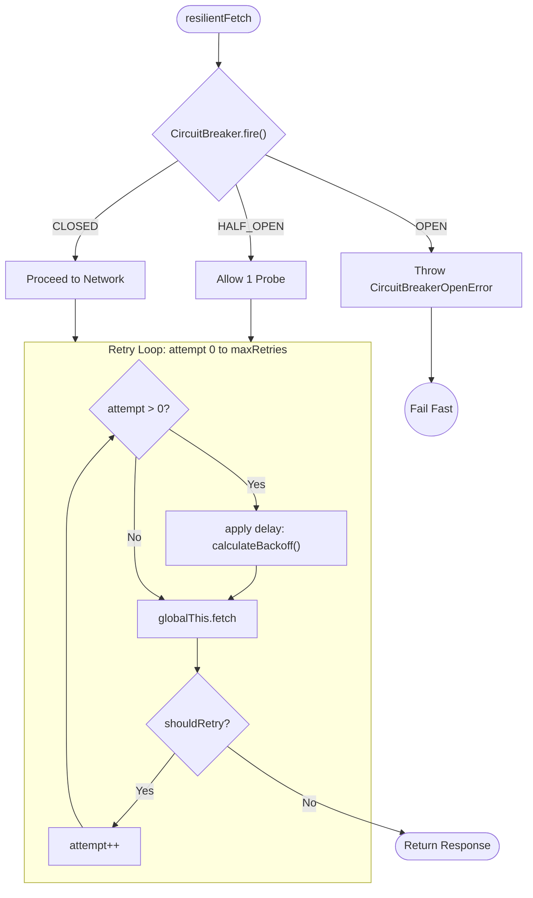

# resilient-fetcher

A zero-dependency TypeScript primitive that wraps `globalThis.fetch` with **exponential backoff** and a **circuit breaker** — built for Edge runtimes, WinterCG, and Next.js Server Components.

---

## Why

Modern infrastructure is asymmetric. Your Edge function responds in **< 50ms**; the upstream API you depend on might be flapping, cold-starting, or rate-limiting. Without resilience primitives, one bad pod takes down your entire request waterfall.

Two patterns solve this:

| Pattern | Problem solved |
|---|---|
| **Exponential Backoff + Full Jitter** | Prevents thundering-herd on transient failures |
| **Circuit Breaker** | Stops cascading failures when a service is down |

`resilient-fetcher` ships both as a single composable factory function with no runtime dependencies — 100% compatible with the [WinterCG Fetch API](https://wintercg.org/) used by Next.js Edge, Cloudflare Workers, and Deno Deploy.

---

## Installation

```bash
pnpm add resilient-fetcher
```

---

## Usage

### Basic

```ts
import { createResilientFetcher } from 'resilient-fetcher';

const fetcher = createResilientFetcher();

const response = await fetcher('https://api.example.com/endpoint');
```

### In a Next.js Server Component

```ts
// app/lib/fetcher.ts
import { createResilientFetcher } from 'resilient-fetcher';

export const fetcher = createResilientFetcher({
  maxRetries: 3,       // 3 retries after the initial attempt
  baseDelay: 200,      // start at 200ms, doubles each attempt
  maxDelay: 10_000,    // cap at 10s
  circuitBreaker: {
    minimumRequests: 5,       // evaluate after at least 5 requests
    failureThreshold: 50,     // trip if >50% fail
    cooldownDuration: 15_000, // re-probe after 15s
  },
});
```

```ts
// app/products/page.tsx
import { fetcher } from '@/lib/fetcher';

export default async function ProductsPage() {
  const res = await fetcher('https://api.example.com/products');
  const data = await res.json();
  return <pre>{JSON.stringify(data, null, 2)}</pre>;
}
```

### Handling a tripped circuit

```ts
import {
  createResilientFetcher,
  CircuitBreakerOpenError,
} from 'resilient-fetcher';

const fetcher = createResilientFetcher();

try {
  const res = await fetcher('https://api.example.com/data');
} catch (err) {
  if (err instanceof CircuitBreakerOpenError) {
    // Return a cached response, serve a degraded UI, or redirect.
    return Response.json({ error: 'service_unavailable' }, { status: 503 });
  }
  throw err;
}
```

---

## API

### `createResilientFetcher(options?)`

Returns a `(input, init?) => Promise<Response>` function with the same signature as `globalThis.fetch`.

| Option | Type | Default | Description |
|---|---|---|---|
| `maxRetries` | `number` | `3` | Retries after the initial attempt |
| `baseDelay` | `number` | `200` | Base backoff delay in ms |
| `maxDelay` | `number` | `10_000` | Backoff ceiling in ms |
| `shouldRetry` | `(res: Response) => boolean` | `res.status >= 500` | Custom retry predicate |
| `circuitBreaker.minimumRequests` | `number` | `5` | Requests before rate evaluation |
| `circuitBreaker.failureThreshold` | `number` | `50` | Failure % to trip the circuit |
| `circuitBreaker.cooldownDuration` | `number` | `10_000` | OPEN → HALF_OPEN probe window in ms |

### `CircuitBreakerOpenError`

Thrown when the circuit is `OPEN`. Extends `Error`. Carries `.state: 'OPEN'` for type-safe discrimination.

---

## Architecture

The primitive operates as a recursive state machine wrapping the native fetch API:



---

## License

MIT © Alejandro Alvarado
